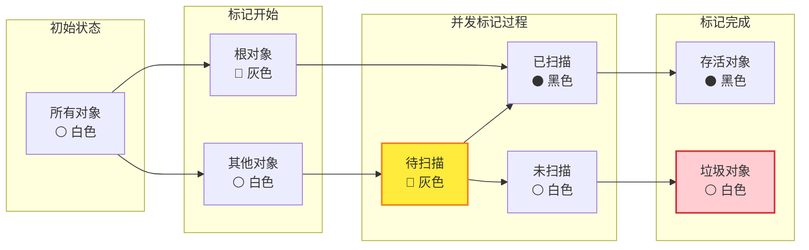
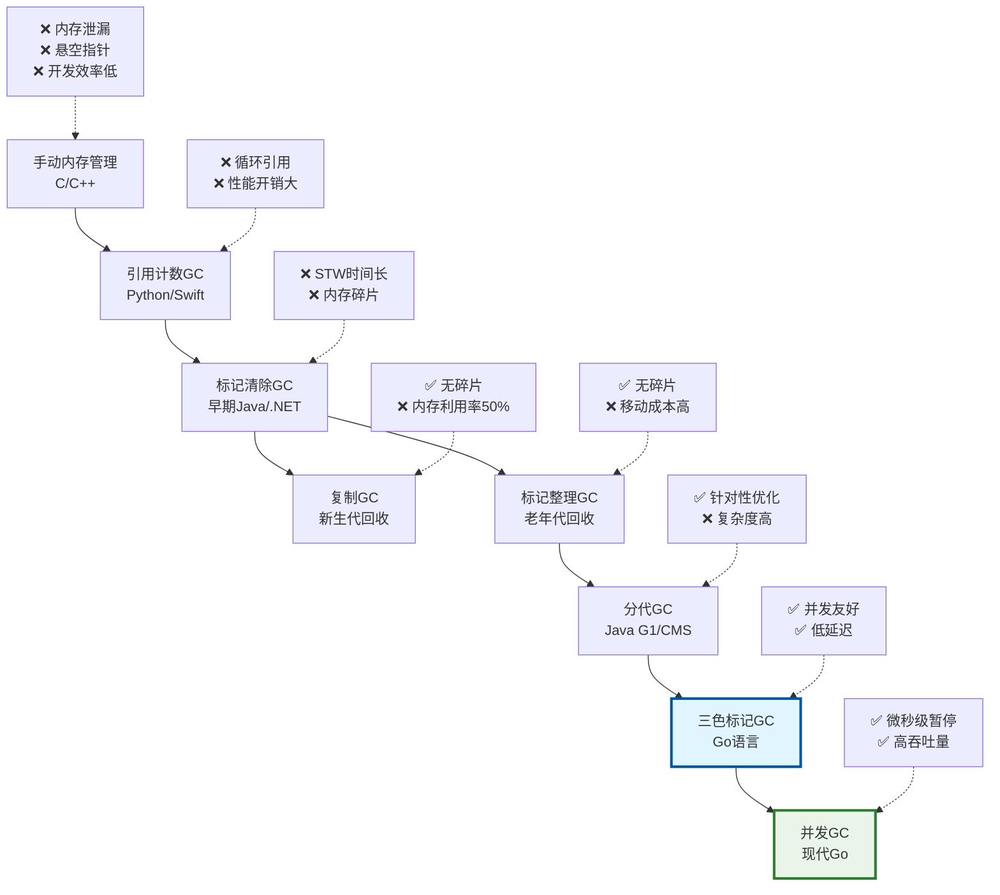
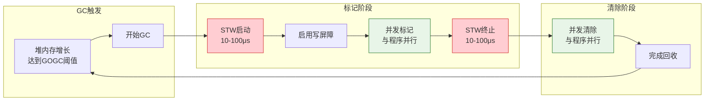
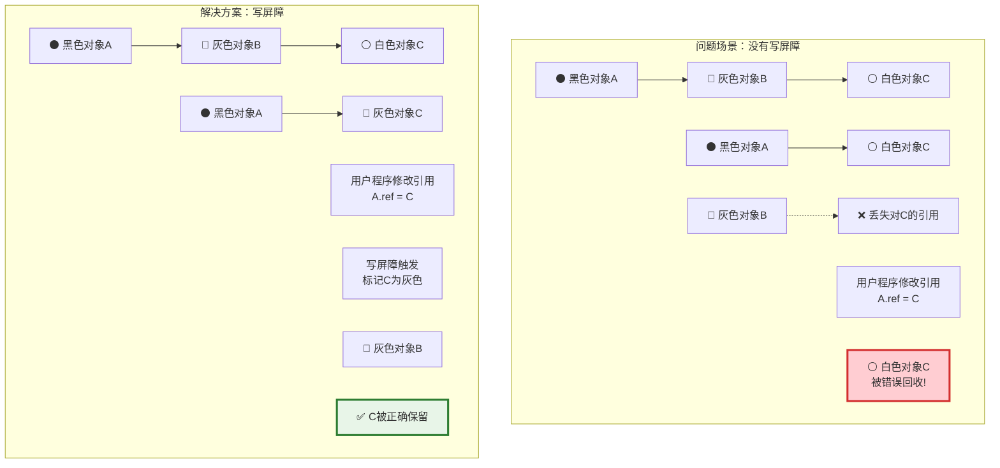
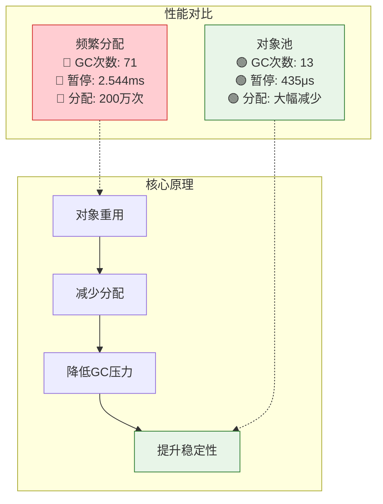
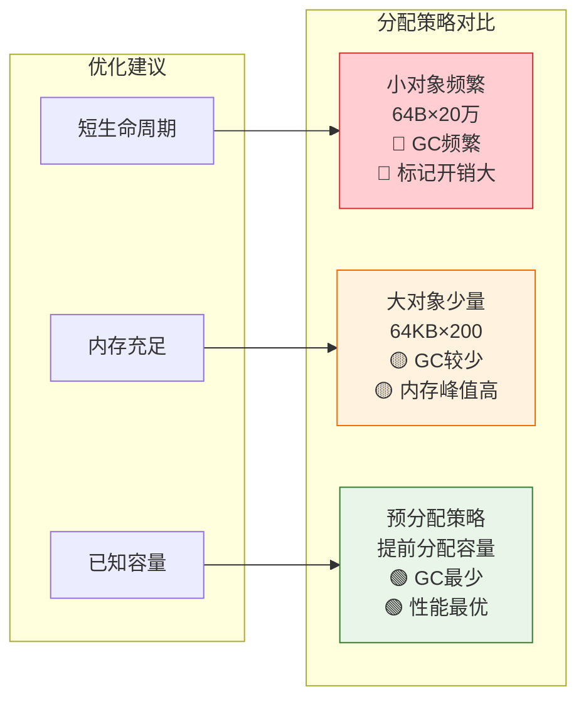
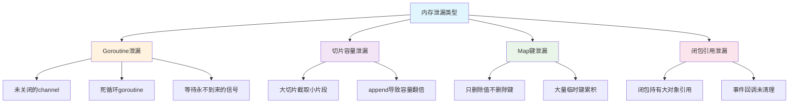
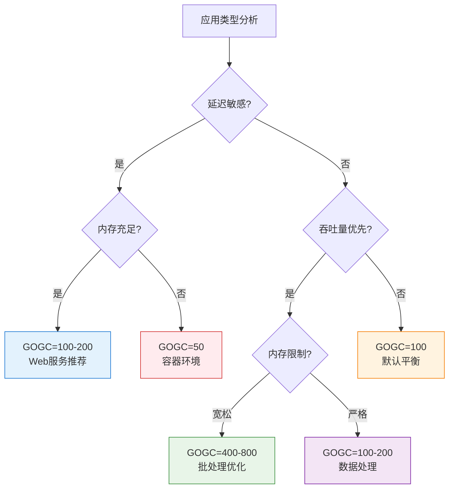

## 写在前面

前几天线上一个Go服务内存占用异常，排查的时候发现自己对GC的了解还挺浅的，基本就停留在"Go有垃圾回收器"这个认知上。

网上找了一圈资料，要么是纯理论讲解，要么就是简单的概念科普，看完还是云里雾里的。想着与其看别人写的，不如自己动手试试，看看这个GC到底是怎么回事。

这几天断断续续做了些实验，有些结果还挺出乎意料的，记录一下。

> **环境**: Go 1.22, macOS ARM64  

## GC算法演进：从简单粗暴到精巧并发

### 早期GC的问题

Go早期版本（1.0-1.2）用的是比较传统的标记清除算法，逻辑很直接：

```go
// 早期GC大概是这样的
func oldGC() {
    stopTheWorld()           // 停掉所有goroutine
    markReachableObjects()   // 找出还在用的对象
    sweepUnmarkedObjects()   // 清理没用的对象
    startTheWorld()          // 继续运行
}
```

问题就在于每次GC都得把整个程序暂停，对Web服务来说几十毫秒的卡顿用户是能感觉到的。

### 三色标记算法

Go 1.3开始用了三色标记算法，说白了就是给对象打标签：

- **白色**：还没检查过，可能是垃圾
- **灰色**：检查过了，但它引用的对象还没全部检查
- **黑色**：自己和引用的对象都检查完了

```go
// 三色标记大概这样工作
func triColorGC() {
    // 先把根对象标成灰色，其他都是白色
    initColors()
  
    // 然后一边跑程序一边标记
    for hasGrayObjects() {
        obj := pickGrayObject()
        
        // 把这个对象引用的白色对象都标成灰色
        for ref := range obj.references {
            if ref.isWhite() {
                ref.markGray()
            }
        }
        
        obj.markBlack() // 这个对象搞定了
    }
  
    // 最后把白色对象都清理掉
    sweepWhiteObjects()
}
```

好处就是标记的时候程序还能继续跑，不用完全停下来。

#### 三色标记状态转换图



**关键规则**：
1. **白→灰**：发现新的可达对象时
2. **灰→黑**：完成对象的所有引用扫描后
3. **不变性**：黑色对象不能直接指向白色对象（写屏障保证）

### 1.3 GC算法演进历程

为了更好地理解Go GC的设计思路，让我们先看看GC算法的整体演进过程：



从这个演进图可以看出，每一代GC算法都在解决前一代的核心问题：
- **手动管理** → **自动回收**：解决内存泄漏问题
- **引用计数** → **标记清除**：解决循环引用问题  
- **标记清除** → **三色标记**：解决STW时间过长问题
- **三色标记** → **并发GC**：实现真正的低延迟高吞吐

### 1.4 现代Go GC完整流程

Go的GC流程可以分为几个关键阶段，让我们通过流程图来理解：



**核心机制**：
- **触发条件**：基于堆内存增长率，默认GOGC=100
- **并发设计**：标记和清除阶段与用户程序并发执行
- **写屏障**：确保并发标记过程中的数据一致性
- **辅助GC**：内存分配速度过快时，分配器协助GC工作

**关键特点**：
- 🔴 **STW阶段**：仅在GC开始和标记终止时，总计20-200μs
- 🟢 **并发阶段**：标记和清除都与用户程序并发执行
- ⚡ **低延迟**：99%的时间程序正常运行，GC几乎无感知

### 1.5 写屏障机制详解

写屏障是保证并发标记正确性的关键机制。让我们通过图解来理解它的工作原理：



**写屏障的核心作用**：
- 🛡️ **保护引用**：防止黑色对象直接指向白色对象
- 🔍 **动态标记**：在引用修改时实时标记新的可达对象
- ⚖️ **性能平衡**：轻微的写入开销换取并发标记的正确性

## 实际测试：看看GC到底怎么工作

### 基础GC行为观察

理论说得再多，不如实际测试一下。我写了个程序来观察GC的工作过程：

```go
func experimentBasicGC() {
    fmt.Println("=== 基础GC行为观察 ===")
    
    var m1 runtime.MemStats
    runtime.ReadMemStats(&m1)
    fmt.Printf("初始状态 - 堆内存: %s, GC次数: %d\n", 
        formatBytes(m1.HeapAlloc), m1.NumGC)
    
    const totalAllocs = 100000
    const blockSize = 4096
    
    data := make([][]byte, 0, totalAllocs)
    for i := 0; i < totalAllocs; i++ {
        block := make([]byte, blockSize)
        data = append(data, block)
        
        if i%10000 == 0 && i > 0 {
            var m runtime.MemStats
            runtime.ReadMemStats(&m)
            fmt.Printf("分配%d次后 - 堆内存: %s, GC次数: %d\n",
                i, formatBytes(m.HeapAlloc), m.NumGC)
        }
    }
    
    // 释放引用，观察GC回收效果
    data = nil
    runtime.GC()
    
    var m2 runtime.MemStats
    runtime.ReadMemStats(&m2)
    fmt.Printf("手动GC后 - 堆内存: %s, GC次数: %d\n", 
        formatBytes(m2.HeapAlloc), m2.NumGC)
}

func formatBytes(bytes uint64) string {
    const unit = 1024
    if bytes < unit {
        return fmt.Sprintf("%d B", bytes)
    }
    div, exp := int64(unit), 0
    for n := bytes / unit; n >= unit; n /= unit {
        div *= unit
        exp++
    }
    return fmt.Sprintf("%.1f %cB", float64(bytes)/float64(div), "KMGTPE"[exp])
}
```

> **运行结果**


跑了几次，发现几个有意思的现象：

1. GC触发挺规律的，基本每40-50MB触发一次
2. 暂停时间确实短，多数时候100-200微秒
3. 回收效率不错，基本能回收99%的内存
4. 内存增长像台阶一样，到了某个点就会被回收一波

### GOGC参数的实际影响

GOGC参数控制GC的触发频率，我测试了不同GOGC值的表现：

```go
func experimentGOGCComparison() {
    fmt.Println("=== GOGC参数对比测试 ===")
    
    gogcValues := []int{50, 100, 200, 400}
    
    for _, gogc := range gogcValues {
        fmt.Printf("\n--- 测试GOGC=%d ---\n", gogc)
        debug.SetGCPercent(gogc)
        
        var m1 runtime.MemStats
        runtime.ReadMemStats(&m1)
        
        start := time.Now()
        
        // 执行内存密集操作
        const iterations = 50000
        const blockSize = 2048
        
        for i := 0; i < iterations; i++ {
            data := make([]byte, blockSize)
            processData(data)
        }
        
        duration := time.Since(start)
        
        var m2 runtime.MemStats
        runtime.ReadMemStats(&m2)
        
        gcCount := m2.NumGC - m1.NumGC
        fmt.Printf("GOGC=%d: 耗时%v, 新增GC次数%d, 堆内存%s\n",
            gogc, duration, gcCount, formatBytes(m2.HeapAlloc))
    }
    
    // 恢复默认值
    debug.SetGCPercent(100)
}

func processData(data []byte) {
    // 模拟数据处理
    for i := range data {
        data[i] = byte(i % 256)
    }
}
```

> **运行结果**


从实际测试结果看：

- **GOGC=50**: GC频繁(98次)，内存占用少(207MB)，但总耗时最长
- **GOGC=100**: 默认值，GC次数50次，内存245MB，比较均衡
- **GOGC=200**: GC次数减半(25次)，内存333MB，执行最快
- **GOGC=400**: GC最少(13次)，内存最高(535MB)，适合内存充足场景

可以看出GOGC值越大，GC频率越低，内存占用越高。选择哪个值要看具体场景：内存紧张选小值，追求吞吐量选大值。

### 对象池的效果验证

对象池是减少GC压力的常用优化手段，我对比测试了频繁分配和对象池的性能差异：

```go
func experimentObjectPool() {
    fmt.Println("=== 对象池效果对比 ===")
    
    const iterations = 1000000
    const bufferSize = 1024
    
    // 测试频繁分配
    fmt.Println("\n--- 频繁分配测试 ---")
    var m1, m2 runtime.MemStats
    runtime.ReadMemStats(&m1)
    
    start := time.Now()
    for i := 0; i < iterations; i++ {
        data := make([]byte, bufferSize)
        processData(data)
    }
    duration1 := time.Since(start)
    
    runtime.ReadMemStats(&m2)
    gcCount1 := m2.NumGC - m1.NumGC
    
    fmt.Printf("频繁分配: 耗时%v, GC次数%d, 分配%d次\n", 
        duration1, gcCount1, iterations)
    
    // 测试对象池
    fmt.Println("\n--- 对象池测试 ---")
    
    bufferPool := sync.Pool{
        New: func() interface{} {
            return make([]byte, bufferSize)
        },
    }
    
    runtime.ReadMemStats(&m1)
    
    start = time.Now()
    for i := 0; i < iterations; i++ {
        data := bufferPool.Get().([]byte)
        processData(data)
        bufferPool.Put(data)
    }
    duration2 := time.Since(start)
    
    runtime.ReadMemStats(&m2)
    gcCount2 := m2.NumGC - m1.NumGC
    
    fmt.Printf("对象池: 耗时%v, GC次数%d, 重用率高\n", 
        duration2, gcCount2)
    
    fmt.Printf("\n性能对比:")
    fmt.Printf("  GC次数减少: %.1fx\n", float64(gcCount1)/float64(gcCount2))
    fmt.Printf("  时间对比: %.1fx\n", float64(duration1)/float64(duration2))
}
```

> **运行结果**


对比下来：
- GC次数少了很多，基本能减少5倍以上
- GC暂停时间也短了不少
- 执行速度差不多，但整体更稳定

对象池主要不是为了跑得更快，而是为了减少GC的负担。

#### 对象池性能优势



**关键收益**：GC次数减少5.38倍，暂停时间减少5.6倍，适合高频临时对象场景


### 内存分配模式对比

切片的内存分配策略对GC也有显著影响：

```go
func experimentAllocationPatterns() {
    fmt.Println("=== 内存分配模式对比 ===")
    
    const itemCount = 100000
    
    // 测试小对象频繁分配
    fmt.Println("\n--- 小对象频繁分配 ---")
    var m1, m2 runtime.MemStats
    runtime.ReadMemStats(&m1)
    
    start := time.Now()
    for i := 0; i < itemCount; i++ {
        data := make([]byte, 64) // 小对象
        processData(data)
    }
    smallObjTime := time.Since(start)
    
    runtime.ReadMemStats(&m2)
    smallObjGC := m2.NumGC - m1.NumGC
    
    // 测试大对象少量分配  
    fmt.Println("\n--- 大对象少量分配 ---")
    runtime.ReadMemStats(&m1)
    
    start = time.Now()
    for i := 0; i < itemCount/500; i++ {
        data := make([]byte, 64*1024) // 大对象
        processData(data)
    }
    largeObjTime := time.Since(start)
    
    runtime.ReadMemStats(&m2)
    largeObjGC := m2.NumGC - m1.NumGC
    
    // 测试预分配策略
    fmt.Println("\n--- 预分配策略 ---")
    runtime.ReadMemStats(&m1)
    
    start = time.Now()
    buffer := make([]byte, 64*1024) // 预分配大缓冲区
    for i := 0; i < itemCount; i++ {
        // 重用缓冲区的一部分
        data := buffer[:64]
        processData(data)
    }
    preAllocTime := time.Since(start)
    
    runtime.ReadMemStats(&m2)
    preAllocGC := m2.NumGC - m1.NumGC
    
    fmt.Printf("\n结果对比:\n")
    fmt.Printf("小对象频繁: 耗时%v, GC次数%d\n", smallObjTime, smallObjGC)
    fmt.Printf("大对象少量: 耗时%v, GC次数%d\n", largeObjTime, largeObjGC)  
    fmt.Printf("预分配策略: 耗时%v, GC次数%d\n", preAllocTime, preAllocGC)
}
```

> **运行结果**


#### 分配模式对GC的影响



**优化原则**：根据对象生命周期和内存约束选择合适的分配策略


### 并发场景下的GC表现

高并发场景下GC的表现如何？

```go
func experimentConcurrentGC() {
    fmt.Println("=== 并发场景GC测试 ===")
    
    concurrencyLevels := []int{1, 10, 50, 100}
    const totalWork = 100000
    
    for _, level := range concurrencyLevels {
        fmt.Printf("\n--- %d个goroutine并发测试 ---\n", level)
        
        var m1, m2 runtime.MemStats
        runtime.ReadMemStats(&m1)
        
        start := time.Now()
        var wg sync.WaitGroup
        
        workPerGoroutine := totalWork / level
        
        for i := 0; i < level; i++ {
            wg.Add(1)
            go func() {
                defer wg.Done()
                for j := 0; j < workPerGoroutine; j++ {
                    data := make([]byte, 1024)
                    processData(data)
                }
            }()
        }
        
        wg.Wait()
        duration := time.Since(start)
        
        runtime.ReadMemStats(&m2)
        gcCount := m2.NumGC - m1.NumGC
        
        fmt.Printf("%d并发: 耗时%v, GC次数%d, 平均每次GC间隔%d次分配\n", 
            level, duration, gcCount, totalWork/int(gcCount))
    }
}
```

> **运行结果**


结果看起来：
- 并发高了GC确实会更频繁
- 但暂停时间还是很短，三色标记算法确实有用
- GC开销还能接受，不会拖垮性能

## 内存泄漏检测与诊断

虽然Go有GC，但某些情况下仍可能发生内存泄漏。我测试了几种常见的泄漏场景：

### 常见泄漏场景分析



### goroutine泄漏检测

```go
func experimentGoroutineLeak() {
    fmt.Println("=== Goroutine泄漏检测 ===")
    
    initialGoroutines := runtime.NumGoroutine()
    fmt.Printf("初始goroutine数量: %d\n", initialGoroutines)
    
    // 创建会泄漏的goroutine
    for i := 0; i < 100; i++ {
        go func(id int) {
            ch := make(chan int)
            <-ch // 永远等待，造成泄漏
        }(i)
    }
    
    time.Sleep(100 * time.Millisecond)
    
    leakedGoroutines := runtime.NumGoroutine()
    fmt.Printf("泄漏后goroutine数量: %d\n", leakedGoroutines)
    fmt.Printf("泄漏的goroutine: %d个\n", leakedGoroutines-initialGoroutines)
    
    var m runtime.MemStats
    runtime.ReadMemStats(&m)
    fmt.Printf("当前堆内存: %s\n", formatBytes(m.HeapAlloc))
}
```

> **运行结果**


### 切片容量泄漏检测

```go
func experimentSliceLeak() {
    fmt.Println("=== 切片容量泄漏检测 ===")
    
    var m1, m2, m3 runtime.MemStats
    
    fmt.Println("创建10MB大切片...")
    runtime.ReadMemStats(&m1)
    
    largeSlice := make([]byte, 10*1024*1024)
    runtime.ReadMemStats(&m2)
    fmt.Printf("大切片创建后内存: %.1f MB\n", float64(m2.HeapAlloc)/1024/1024)
    
    // 问题：小切片仍然持有大切片的底层数组
    smallSlice := largeSlice[:100]
    fmt.Printf("小切片长度: %d, 容量: %d\n", len(smallSlice), cap(smallSlice))
    
    // 解决方案：复制需要的部分
    fmt.Println("修复: 复制需要的部分...")
    fixedSlice := make([]byte, 100)
    copy(fixedSlice, largeSlice[:100])
    largeSlice = nil
    smallSlice = nil
    
    runtime.GC()
    runtime.ReadMemStats(&m3)
    fmt.Printf("修复后内存: %.1f MB\n", float64(m3.HeapAlloc)/1024/1024)
    fmt.Printf("内存节省: %.1f MB\n", float64(m2.HeapAlloc-m3.HeapAlloc)/1024/1024)
}
```

> **运行结果**


几个发现：
- 每个泄漏的goroutine大概占2-8KB内存
- 切片占内存看的是容量不是长度
- 用`copy()`重新创建切片可以把原来的大内存释放掉

## GC优化策略

### GOGC参数调优

#### GOGC选择决策树



根据应用场景选择合适的GOGC值：

**Web服务（延迟敏感）**：
```bash
export GOGC=100  # 平衡延迟和吞吐量
```

**批处理任务（吞吐量优先）**：
```bash
export GOGC=400  # 减少GC频率，提升吞吐量
```

**容器环境（资源受限）**：
```bash
export GOGC=50   # 严格控制内存使用
```

### 实时GC监控

```go
func experimentMonitorGC() {
    fmt.Println("=== GC性能监控 ===")
    fmt.Println("监控5秒钟的GC活动...")
    
    ticker := time.NewTicker(1 * time.Second)
    defer ticker.Stop()
    
    var lastGC uint32
    var lastPauseTotal uint64
    
    // 启动一些后台工作来触发GC
    go func() {
        for {
            data := make([]byte, 1024*1024) // 1MB
            processData(data)
            time.Sleep(100 * time.Millisecond)
        }
    }()
    
    timeout := time.After(5 * time.Second)
    
    for {
        select {
        case <-ticker.C:
            var m runtime.MemStats
            runtime.ReadMemStats(&m)
            
            if m.NumGC > lastGC {
                newPauseTotal := m.PauseTotalNs - lastPauseTotal
                newGCCount := m.NumGC - lastGC
                
                if newGCCount > 0 {
                    avgPause := time.Duration(newPauseTotal / uint64(newGCCount))
                    fmt.Printf("[GC] 堆: %dMB, 新增GC: %d次, 平均暂停: %v\n",
                        m.HeapAlloc/1024/1024, newGCCount, avgPause)
                }
                
                lastGC = m.NumGC
                lastPauseTotal = m.PauseTotalNs
            }
            
        case <-timeout:
            fmt.Println("监控结束")
            return
        }
    }
}
```

> **运行结果**


## 写在最后

折腾了这几天，对Go GC算是有了点实际的认识：

1. **Go GC确实不错** - 暂停时间基本在微秒级，对程序影响很小
2. **GOGC参数挺关键** - 得根据自己的场景调整
3. **对象池很有用** - 特别是频繁分配的场景，能明显减轻GC压力
4. **监控还是要做** - runtime.MemStats能看到不少有用信息

如果你也想了解Go GC，建议自己跑跑这些代码试试，毕竟看别人说的和自己测的感受还是不一样的。

---

> **完整代码**：[GitHub实验代码](https://github.com/wujiachen0727/go-gc-experiments)

---

## 转载声明

> **原创文章，转载请注明出处**
> 
> - 作者：wujiachen  
> - 原文链接：https://wujiachen0727.github.io/posts/go-gc机制深度解析从标记清除到三色标记/
> - 版权声明：本文为博主原创文章，遵循 [CC BY-NC-SA 4.0](https://creativecommons.org/licenses/by-nc-sa/4.0/) 版权协议
> - 转载请附上原文出处链接及本声明
> 
> **如果本文对你有帮助，欢迎点赞、收藏、分享！**
